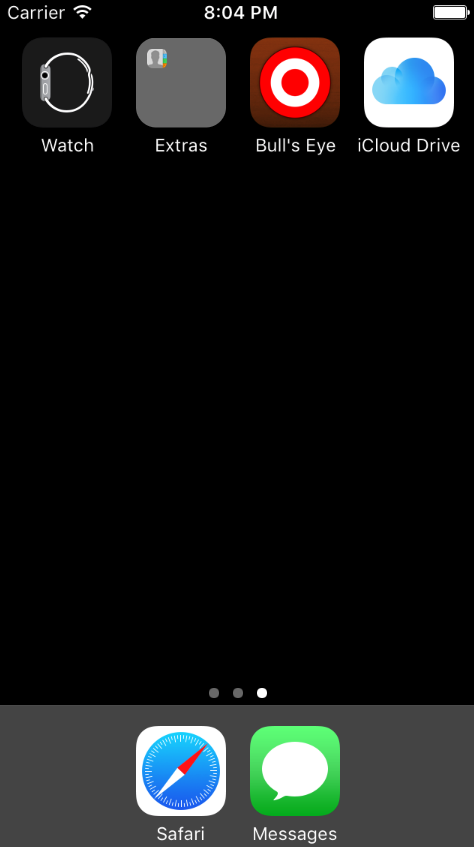
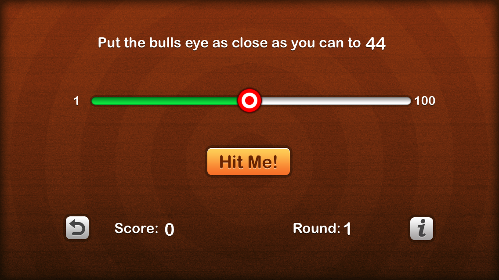
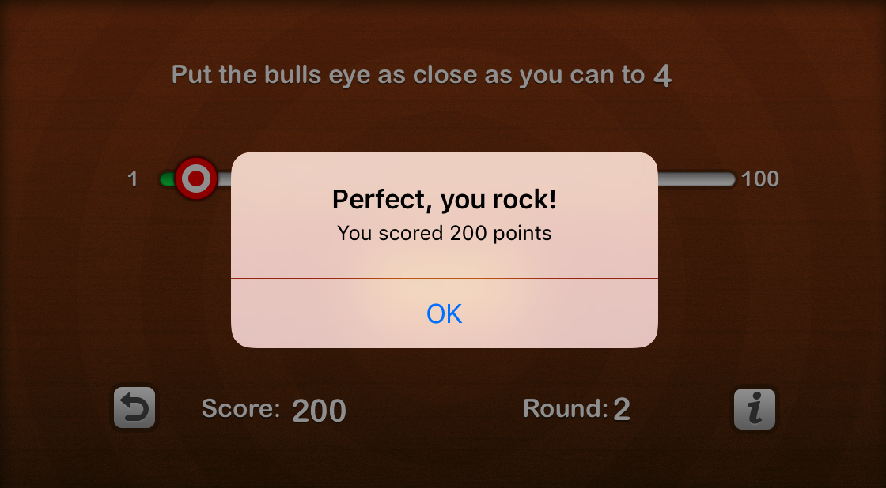
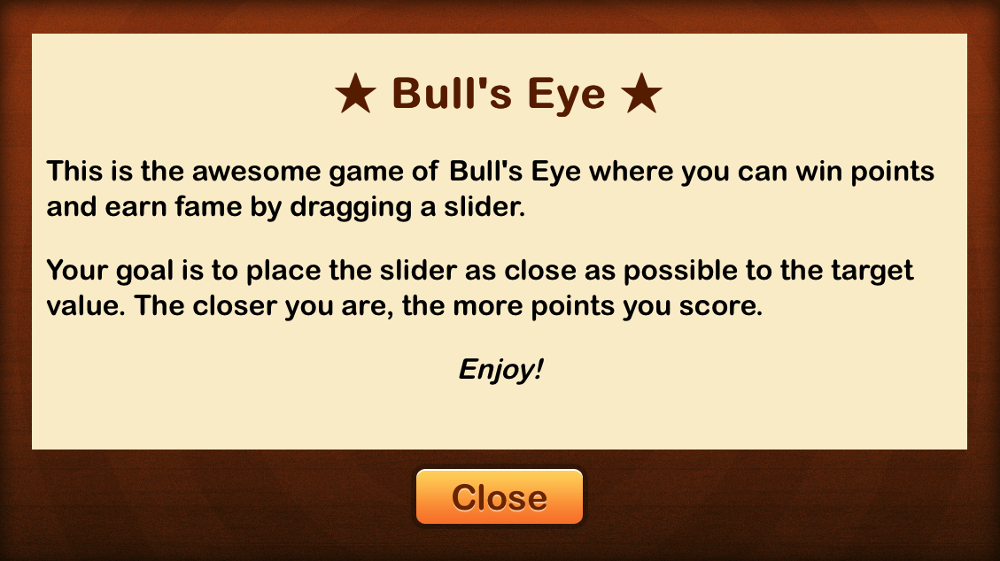

# Bull's Eye

[Intro](#intro) | [Features](#features) | [Installation](#installation)  [Technologies](#technologies)

## <a name="intro">Intro

A simple iOS game app built using Xcode and Swift.  This app was built using the tools and resources of **part 1** of **raywenderlich.com's** awesome 'iOS Apprentice' course, available [here](https://www.raywenderlich.com/store/ios-apprentice).

  

  

  

  

## <a name="intro">Features

- [X] As a User I am given a target number between 1 and 100 (a "**Target**").

- [X] As a User I am able to move a bull's eye on a UI slider to guess the location of the Target on the slider (a "**Guess**").

- [X] As a User I am able to touch a "Hit Me" button to display a pop-up explaining how close the Guess was to the Target.

- [X] As a User I am shown the current round, which should increase after each round.

- [X] As a User I am shown my current total score, which should increase after each round.

- [X] As a User I am rewarded with a higher value of points the closer my Guess is to the Target.

- [X] As a User I am able to touch a "Start Over" button to restart the game afresh with scores and rounds zeroed.

- [X] As a User I am able to touch an "Info" button to show an "About" page displaying the rules of the game.

## <a name="intro">Installation

### Via Xcode

1.  Download and install Xcode for Mac here.

2.  Set-up an Apple Developer account.

3.  Clone this repo by running ``git clone git@github.com:awye765/bullseye.git``

4.  Open this repo in Xcode and run the app via Xcode's device simulator.

### Via your iPhone / iPad

1.  Same as steps 1 - 3 above.

2.  Open Xcode.

3.  Follow this [guide](https://developer.apple.com/library/content/documentation/IDEs/Conceptual/AppDistributionGuide/LaunchingYourApponDevices/LaunchingYourApponDevices.html).
